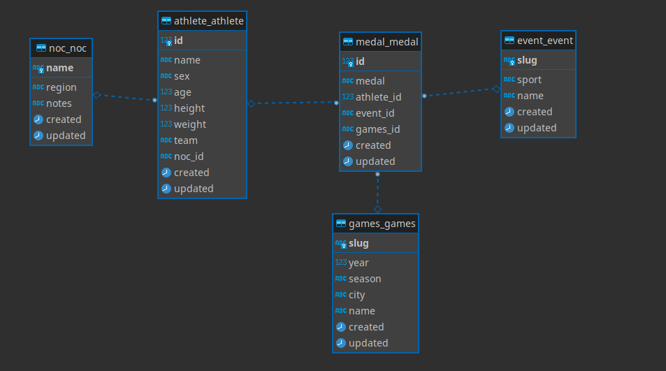

# DRF Olimpíadas

Django REST Framework comportando os dados do dataset [120 years of Olympic history: athletes and results](https://www.kaggle.com/datasets/heesoo37/120-years-of-olympic-history-athletes-and-results).

## Este projeto foi feito com:
* [Python 3.9](https://www.python.org/)
* [Django 4.0](https://www.djangoproject.com/)
* [Django Rest Framework 3.0](https://www.django-rest-framework.org/)
* [Docker 20.10.5](https://www.docker.com/)
* [Docker Compose 1.25](https://docs.docker.com/compose/)
* [PostgreSQL 13](https://www.postgresql.org/)

## Requisitos

Para executar este projeto é necessário ter instalado:
- Python>=3.0
- Docker>=20.0
- docker-compose>=1.25

## Executando o projeto

Clone este repositório com o comando `git clone https://github.com/abelsco/django-rest-athlete`

Acesse a pasta com `cd django-rest-athlete`

Execute os containers com `docker-compose up -d`

Agora acesse o container web com o comando `docker exec -it django-rest-athlete_web_1 bash`

Dentro do container execute:
* `python manage.py createsuperuser` para criar um superuser
* `python populatedb.py` para popular o banco com as informações contidas nos datasets

> Tive que realizar uma alteração no dataset `noc_regions.csv` pois a NOC de Singapura estava incorreta, você pode ver neste [commit](https://github.com/abelsco/django-rest-athlete/commit/f855681c7cc348c2c4d69736dcb4d276d455fe89)

Para parar os serviços `docker-compose down`

## Diagrama do Banco

Além das tabelas utilizadas pelos apps foram criadas as seguintes tabelas com seus respectivos relacionamentos

## Utilização da API

Endereço da API `http://localhost:8000/api/v1`

Endereço do admin `http://localhost:8000/admin`

No arquivo `API_V1.json` você encontra alguns exemplos de utilização, caso você utilize o [postman](https://www.postman.com/) você poderá importar a coleção.

### Padrões de URL

|                 Métodos                 |              Descrição              | Exemplos                                          |
|:---------------------------------------:|:-----------------------------------:|---------------------------------------------------|
| /nations                                | Retorna a lista de NOC's            | -                                                 |
| /nations?format=api\|json               | Formata a lista de NOC's            | /nations?format=json                              |
| /nations/<string:name>                  | Procura a NOC "name"                | /nations/BRA                                      |
| /nations/<string:name>?format=api\|json | Procura a NOC "name" e formata      | /nations/BRA?format=json                          |
| /games                                  | Retorna a lista de Jogos            | -                                                 |
| /games?format=api\|json                 | Formata a lista de Jogos            | /games?format=api                                 |
| /games/<string:slug>                    | Procura o Jogo "slug"               | /games/2016-summer                                |
| /games/<string:slug>?format=api\|json   | Procura o Jogo "slug" e formata     | /games/2016-summer?format=json                    |
| /athletes                               | Retorna a lista de Atletas          | -                                                 |
| /athletes?format=api\|json              | Formata a lista de Atletas          | -                                                 |
| /athletes/<int:id>                      | Procura o Atleta pelo id            | /athletes/2                                       |
| /athletes/<int:id>?format=api\|json     | Procura o Atleta pelo id e formata  | /athletes/2?format=json                           |
| /medals                                 | Retorna a lista de Medalhas         | -                                                 |
| /medals?format=api\|json                | Formata a lista de Medalhas         | -                                                 |
| /medals/<int:id>                        | Procura a Medalha pelo id           | /medals/1300                                      |
| /medals/<int:id>?format=api\|json       | Procura a Medalha pelo id e formata | /medals/1300?format=api                           |
| /events                                 | Retorna a lista de Eventos          | -                                                 |
| /events?format=api\|json                | Formata a lista de Eventos          | -                                                 |
| /events/<string:slug>                   | Procura o Evento "slug"             | /events/wrestling-women-s-middleweight            |
| /events/<string:slug>?format=api\|json  | Procura o Evento "slug" e formata   | /events/wrestling-women-s-middleweight?format=api |